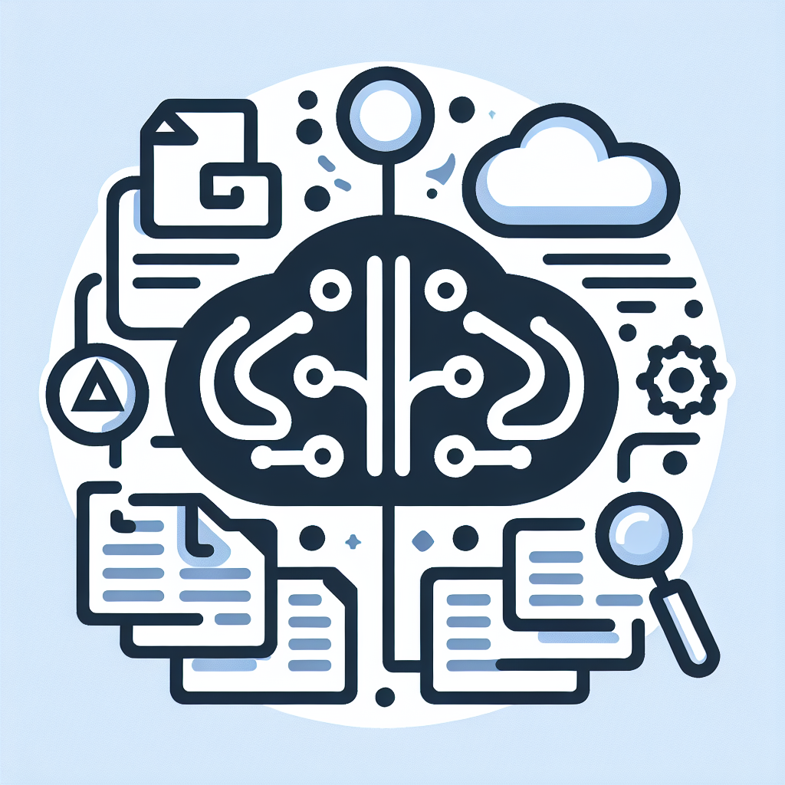

<!-- Improved compatibility of back to top link: See: https://github.com/PDangelmaier/paperless-ngx-n8n-integration/pull/73 -->
<a id="readme-top"></a>
<!--
*** Thanks for checking out the Best-README-Template. If you have a suggestion
*** that would make this better, please fork the repo and create a pull request
*** or simply open an issue with the tag "enhancement".
*** Don't forget to give the project a star!
*** Thanks again! Now go create something AMAZING! :D
-->


<!-- PROJECT SHIELDS -->
<!--
*** I'm using markdown "reference style" links for readability.
*** Reference links are enclosed in brackets [ ] instead of parentheses ( ).
*** See the bottom of this document for the declaration of the reference variables
*** for contributors-url, forks-url, etc. This is an optional, concise syntax you may use.
*** https://www.markdownguide.org/basic-syntax/#reference-style-links
-->
[![Contributors][contributors-shield]][contributors-url]
[![Forks][forks-shield]][forks-url]
[![Stargazers][stars-shield]][stars-url]
[![Issues][issues-shield]][issues-url]
[![Unlicense License][license-shield]][license-url]
[![LinkedIn][linkedin-shield]][linkedin-url]


<!-- PROJECT LOGO -->
<br />
<div align="center">
  <a href="https://github.com/PDangelmaier/paperless-ngx-n8n-integration">
    
  </a>

  <h3 align="center">Paperless-ngx and n8n Integration via Model Context Protocol</h3>

  <p align="center">
    A seamless integration between Paperless-ngx document management system and n8n workflow automation using the Model Context Protocol
    <br />
    <a href="https://github.com/PDangelmaier/paperless-ngx-n8n-integration"><strong>Explore the docs »</strong></a>
    <br />
    <br />
    <a href="https://github.com/PDangelmaier/paperless-ngx-n8n-integration">View Demo</a>
    &middot;
    <a href="https://github.com/PDangelmaier/paperless-ngx-n8n-integration/issues/new?labels=bug&template=bug-report---.md">Report Bug</a>
    &middot;
    <a href="https://github.com/PDangelmaier/paperless-ngx-n8n-integration/issues/new?labels=enhancement&template=feature-request---.md">Request Feature</a>
  </p>
</div>


<!-- TABLE OF CONTENTS -->
<details>
  <summary>Table of Contents</summary>
  <ol>
    <li>
      <a href="#about-the-project">About The Project</a>
      <ul>
        <li><a href="#built-with">Built With</a></li>
      </ul>
    </li>
    <li>
      <a href="#getting-started">Getting Started</a>
      <ul>
        <li><a href="#prerequisites">Prerequisites</a></li>
        <li><a href="#installation">Installation</a></li>
      </ul>
    </li>
    <li><a href="#usage">Usage</a></li>
    <li><a href="#roadmap">Roadmap</a></li>
    <li><a href="#contributing">Contributing</a></li>
    <li><a href="#license">License</a></li>
    <li><a href="#contact">Contact</a></li>
    <li><a href="#acknowledgments">Acknowledgments</a></li>
  </ol>
</details>


<!-- ABOUT THE PROJECT -->
## About The Project

[![Product Name Screen Shot][product-screenshot]](https://example.com)

This project implements an integration between Paperless-ngx (a document management system) and n8n (a workflow automation tool) using the Model Context Protocol (MCP). This integration allows AI models to interact with your document management system and automate workflows between these tools in a standardized way.

### What is Model Context Protocol (MCP)?

The Model Context Protocol (MCP) is a standardized way for applications to provide context to AI models. It allows for:
* Exposing data through Resources (similar to GET endpoints)
* Providing functionality through Tools (similar to POST endpoints)
* Defining interaction patterns through Prompts (reusable templates)

By implementing MCP for Paperless-ngx and n8n, we create a bridge that enables AI models to:
* Query and retrieve document information from Paperless-ngx
* Trigger and manage workflows in n8n
* Create automation chains between these systems
* Process and analyze documents in intelligent ways

<p align="right">(<a href="#readme-top">back to top</a>)</p>


### Built With

This integration is built with the following technologies:

* [Python](https://www.python.org/) - The primary programming language for the MCP server
* [Paperless-ngx](https://docs.paperless-ngx.com/) - Document management system
* [n8n](https://n8n.io/) - Workflow automation tool
* [Model Context Protocol](https://github.com/anthropics/anthropic-cookbook/blob/main/model_context_protocol/README.md) - Protocol for AI model integration

<p align="right">(<a href="#readme-top">back to top</a>)</p>


<!-- GETTING STARTED -->
## Getting Started

Follow these instructions to set up the MCP integration between Paperless-ngx and n8n on your local system.

### Prerequisites

Before you begin, ensure you have the following:

* A running instance of Paperless-ngx
* A running instance of n8n
* Python 3.8 or higher
* Access to an AI model that supports MCP (such as Claude)

### Installation

1. Clone the repository
   ```sh
   git clone https://github.com/PDangelmaier/paperless-ngx-n8n-integration.git
   cd paperless-ngx-n8n-integration
   ```

2. Install the MCP Python SDK
   ```sh
   pip install mcp-sdk
   ```

3. Set up environment variables for your integration
   ```sh
   export PAPERLESS_NGX_API_URL="https://your-paperless-instance/api"
   export PAPERLESS_NGX_API_KEY="your-api-key"
   export N8N_API_URL="https://your-n8n-instance/api"
   export N8N_API_KEY="your-api-key"
   ```

4. Run your MCP server
   ```sh
   python mcp_server.py
   ```

5. Install in Claude Desktop (if you're using Claude as your LLM)
   ```sh
   # Follow the Claude Desktop instructions for installing custom MCP integrations
   ```

<p align="right">(<a href="#readme-top">back to top</a>)</p>


<!-- USAGE EXAMPLES -->
## Usage

Once the MCP server is running, AI models that support MCP can interact with your Paperless-ngx and n8n systems in various ways:

### Query Document Information

```
# Example prompt to an MCP-enabled AI model
Please find all invoices from last month in my Paperless-ngx system and summarize them.
```

The AI can:
* Access document metadata
* Search for documents by content
* List tags and categories

### Automate Workflows

```
# Example prompt to an MCP-enabled AI model
When I receive a new invoice from Acme Corp, trigger the invoice processing workflow in n8n.
```

The AI can:
* Trigger n8n workflows with specific documents
* Process documents and update metadata
* Create automation chains between paperless-ngx and other systems

### Analyze Documents

```
# Example prompt to an MCP-enabled AI model
Review this contract document and extract the key obligations and deadlines.
```

The AI can:
* Generate summaries of documents
* Suggest appropriate tags
* Extract action items or important information

_For more examples, please refer to the [Documentation](https://github.com/PDangelmaier/paperless-ngx-n8n-integration/wiki)_

<p align="right">(<a href="#readme-top">back to top</a>)</p>


<!-- ROADMAP -->
## Roadmap

<<<<<<< HEAD
- [x] Basic MCP server implementation
- [x] Paperless-ngx document retrieval integration
- [x] n8n workflow triggering functionality
- [ ] Enhanced document analysis capabilities
- [ ] Support for custom document processing workflows
- See the [open issues](https://github.com/PDangelmaier/paperless-ngx-n8n-integration/issues) for a full list of proposed features (and known issues).
=======
- [x] Add Changelog
- [x] Add back to top links
- [ ] Add Additional Templates w/ Examples
- [ ] Add "components" document to easily copy & paste sections of the readme
- [ ] Multi-language Support
    - [ ] Chinese
    - [ ] Spanish

See the [open issues](https://github.com/PDangelmaier/paperless-ngx-n8n-integration/issues) for a full list of proposed features (and known issues).
>>>>>>> 7064d2687701965746684bdff81c72a7d915d0a9

<p align="right">(<a href="#readme-top">back to top</a>)</p>


<!-- CONTRIBUTING -->
## Contributing

Contributions are what make the open source community such an amazing place to learn, inspire, and create. Any contributions you make are **greatly appreciated**.

If you have a suggestion that would make this better, please fork the repo and create a pull request. You can also simply open an issue with the tag "enhancement".
Don't forget to give the project a star! Thanks again!

1. Fork the Project
2. Create your Feature Branch (`git checkout -b feature/AmazingFeature`)
3. Commit your Changes (`git commit -m 'Add some AmazingFeature'`)
4. Push to the Branch (`git push origin feature/AmazingFeature`)
5. Open a Pull Request

### Top contributors:

<a href="https://github.com/PDangelmaier/paperless-ngx-n8n-integration/graphs/contributors">
<<<<<<< HEAD
  
=======
  
>>>>>>> 7064d2687701965746684bdff81c72a7d915d0a9
</a>

<p align="right">(<a href="#readme-top">back to top</a>)</p>


<!-- LICENSE -->
## License

Distributed under the Unlicense License. See `LICENSE.txt` for more information.

<p align="right">(<a href="#readme-top">back to top</a>)</p>


<!-- CONTACT -->
## Contact

P. Dangelmaier - [@PDangelmaier](https://github.com/PDangelmaier)

<<<<<<< HEAD
Project Link: [https://github.com/PDangelmaier/paperless-ngx-n8n-integration](https://github.com/PDangelmaier/paperless-ngx-n8n-integration)
=======
Project Link: https://github.com/PDangelmaier/paperless-ngx-n8n-integration/
>>>>>>> 7064d2687701965746684bdff81c72a7d915d0a9

<p align="right">(<a href="#readme-top">back to top</a>)</p>


<!-- ACKNOWLEDGMENTS -->
## Acknowledgments

Resources and projects that helped make this integration possible:

* [Paperless-ngx](https://github.com/paperless-ngx/paperless-ngx) - The amazing document management system
* [n8n](https://n8n.io/) - The powerful workflow automation platform
* [Model Context Protocol](https://github.com/anthropics/anthropic-cookbook/blob/main/model_context_protocol/README.md) - For enabling standardized AI interactions
* [Anthropic Claude](https://www.anthropic.com/claude) - A powerful AI assistant that supports MCP
* [Best-README-Template](https://github.com/othneildrew/Best-README-Template) - For the README structure

## Benefits of This Approach

1. **Standardized Interface**: MCP provides a consistent way for AI models to interact with your paperless-ngx and n8n systems.
2. **Security**: The MCP server controls what data and functionality is exposed to the AI.
3. **Extensibility**: You can easily add more resources and tools as needed.
4. **AI Model Agnostic**: Works with any AI model that supports the Model Context Protocol.

<p align="right">(<a href="#readme-top">back to top</a>)</p>


<!-- MARKDOWN LINKS & IMAGES -->
<!-- https://www.markdownguide.org/basic-syntax/#reference-style-links -->
[contributors-shield]: https://img.shields.io/github/contributors/PDangelmaier/paperless-ngx-n8n-integration.svg?style=for-the-badge
[contributors-url]: https://github.com/PDangelmaier/paperless-ngx-n8n-integration/graphs/contributors
[forks-shield]: https://img.shields.io/github/forks/PDangelmaier/paperless-ngx-n8n-integration.svg?style=for-the-badge
[forks-url]: https://github.com/PDangelmaier/paperless-ngx-n8n-integration/network/members
[stars-shield]: https://img.shields.io/github/stars/PDangelmaier/paperless-ngx-n8n-integration.svg?style=for-the-badge
[stars-url]: https://github.com/PDangelmaier/paperless-ngx-n8n-integration/stargazers
[issues-shield]: https://img.shields.io/github/issues/PDangelmaier/paperless-ngx-n8n-integration.svg?style=for-the-badge
[issues-url]: https://github.com/PDangelmaier/paperless-ngx-n8n-integration/issues
[license-shield]: https://img.shields.io/github/license/PDangelmaier/paperless-ngx-n8n-integration.svg?style=for-the-badge
[license-url]: https://github.com/PDangelmaier/paperless-ngx-n8n-integration/blob/main/LICENSE.txt
[linkedin-shield]: https://img.shields.io/badge/-LinkedIn-black.svg?style=for-the-badge&logo=linkedin&colorB=555
[linkedin-url]: https://linkedin.com/in/PDangelmaier
[product-screenshot]: images/screenshot.png
[Next.js]: https://img.shields.io/badge/next.js-000000?style=for-the-badge&logo=nextdotjs&logoColor=white
[Next-url]: https://nextjs.org/
[React.js]: https://img.shields.io/badge/React-20232A?style=for-the-badge&logo=react&logoColor=61DAFB
[React-url]: https://reactjs.org/
[Vue.js]: https://img.shields.io/badge/Vue.js-35495E?style=for-the-badge&logo=vuedotjs&logoColor=4FC08D
[Vue-url]: https://vuejs.org/
[Angular.io]: https://img.shields.io/badge/Angular-DD0031?style=for-the-badge&logo=angular&logoColor=white
[Angular-url]: https://angular.io/
[Svelte.dev]: https://img.shields.io/badge/Svelte-4A4A55?style=for-the-badge&logo=svelte&logoColor=FF3E00
[Svelte-url]: https://svelte.dev/
[Laravel.com]: https://img.shields.io/badge/Laravel-FF2D20?style=for-the-badge&logo=laravel&logoColor=white
[Laravel-url]: https://laravel.com
[Bootstrap.com]: https://img.shields.io/badge/Bootstrap-563D7C?style=for-the-badge&logo=bootstrap&logoColor=white
[Bootstrap-url]: https://getbootstrap.com
[JQuery.com]: https://img.shields.io/badge/jQuery-0769AD?style=for-the-badge&logo=jquery&logoColor=white
[JQuery-url]: https://jquery.com
